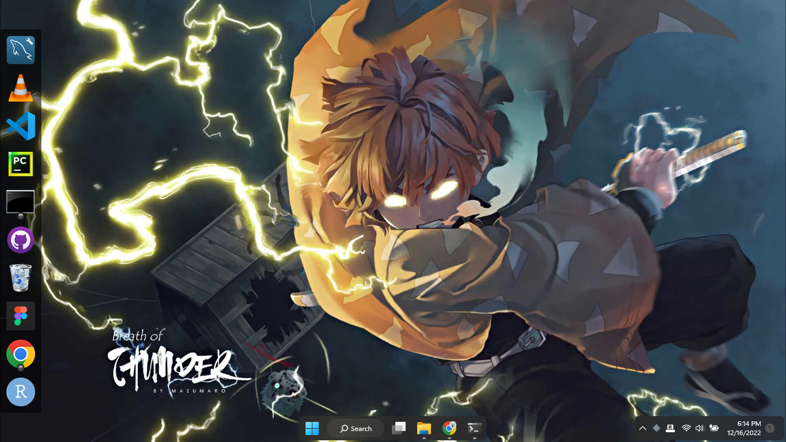

<p align="center" style="font-size: 40px;">INSTALLATION</p>

### STEP 1: CLEANING TASKBAR
```
Cleaning your taskbar by chosing what is necessary 
	- Mine was : 
		 Menu, search box, and explorer
```

### STEP 2: DOWNLOAD AND INSTALL NEXUS
DOWNLOAD AND INSTALL NEXUS. [DOWNLOAD IT HERE](https://nexus.en.softonic.com/)
```
Install nexus and do the following :
	- After installing remove unnessary pre-built apps
	- Locate your chosen app, find their shortcuts 
	and add them to nexus by dragging.
	- Make you own list mine were:
	    Vscode, workbench, Github Desktop, Terminal and Chrome
```

CONFIGURE NEXUS SETTINGS 
```
Right click the nexus background
Click preferences
	- Click position 
	    left and center
	- Click appearance
		50 pixels size
		running indicator (gloss circle black)
	- Click effects
		click bounce as launch effect
	- Click themes
		windows10Nx
	- Click wallpaper in themes also
		windows10Nx
```

### STEPS 3: INSTALL ROUNDEDTB IN MICROSOFT STORE
```
Margin set to 3
Corner radius 25
Click advance
	check dynamic
	check show system tray win+f2
	check translucentTB
```

### STEPS 4: DOWNLOAD YOUR CHOSEN MP4 VIDEO FORMAT
```
Convert the format to wmv (windows media video)
```
### STEPS 5: DOWNLOAD DESKTOP LIVE WALLPAPER APPLICATION ON MICROSOFT STORE
```
Use your converted wmv wallpaper
```
		
### STEPS 6: REMOVE TASKBAR ( CLICK WINDOWS BUTTON TO SHOW)
```
	- Right click taskbar settings
	- Go to taskbar behavior and hide 
		This will make your task bar gone but try to browse it and it will appear
```		

### COMPLETE
#### OUTPUT


## AUTHOR
GILLBERT PADON

